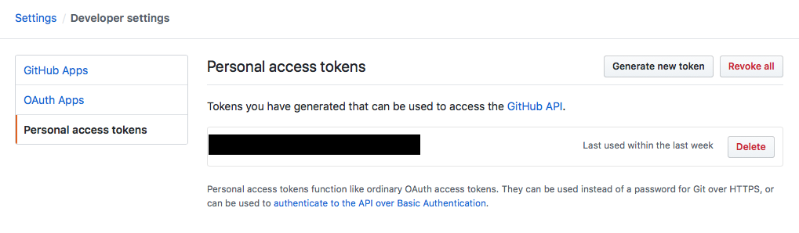
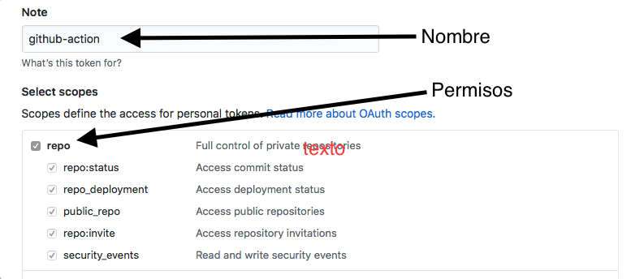
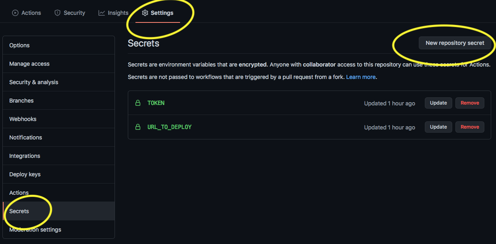
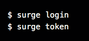

# github-actions

## Actualizar la "patch version" del package.json con GitHub Actions

Para realizar esta acción, vas a necesitar crear un token de GitHub".  

Accede a la configuración de tu cuenta: settings >> Developer settings >> Personal access tokens >> Generate new token.  
  

Luego asíganle un nombre y selecciona los permisos para "repo".  
  

En tu repositorio, crea un directorio llamado `.github/workflows` y añade ahí la acción `update-patch-version.yml` que encontrarás en este repositorio.  

Fíjate que puedes configurar la rama sobre la que quieras que se ejecute la acción y la versión de Node.js que se va a utilizar.  

------

## Correr los test y el linter con cada push y en cada pull request

En tu repositorio, crea un directorio llamado `.github/workflows` y añade ahí la acción `run-test-and-linter.yml` que encontrarás en este repositorio.  

Fíjate que puedes configurar la rama sobre la que quieras que se ejecute la acción y la versión de Node.js que se va a utilizar (en el ejemplo te dejo la acción funcionando para dos ramas y en dos versiones de Node.js distintas).

------

## Publicar una web estática en Surge.sh con cada push a master

Añade la acción llamada `deploy-static-web-to-surge.yml`. Fíjate que estamos deployando la raíz. Recuerda que debes definir como "secreto" la URL de destino y el token de Surge. 

Para obtener el token de Surge, lanza estos comandos en el terminal:  

####  Si necesitas primero hacer el build sigue estas instrucciones: 

El procedimiento es el mismo que en el caso anterior, pero esta vez utiliza la acción `deploy-to-surge.yml`.  

Fíjate que en la acción lanzamos el comando para crear el build (TIP: podrías lanzar cualquier otro comando que haya definido en el package.json). Fíjate también que al lanzar el comando para publicar la web, estamos indicando el directorio "output" de la build.

------